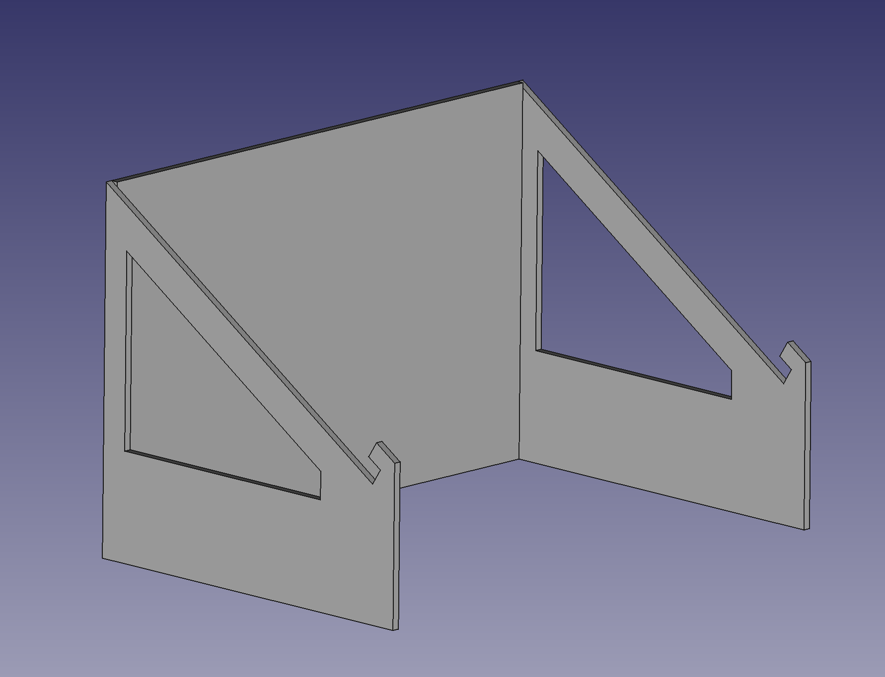

Work In Progress A laptop stand with two levels of drawers and an angled stand.

The goal is that it will have a classical drawer at the bottom and a hinged drawer that swings out to the front of the stand at the side.

I need to figgure out some way of getting the top support-beam consistent without having so much padding in the front or saccrificing to much height in the lower-drawer but this is the construction as it stands right now:

